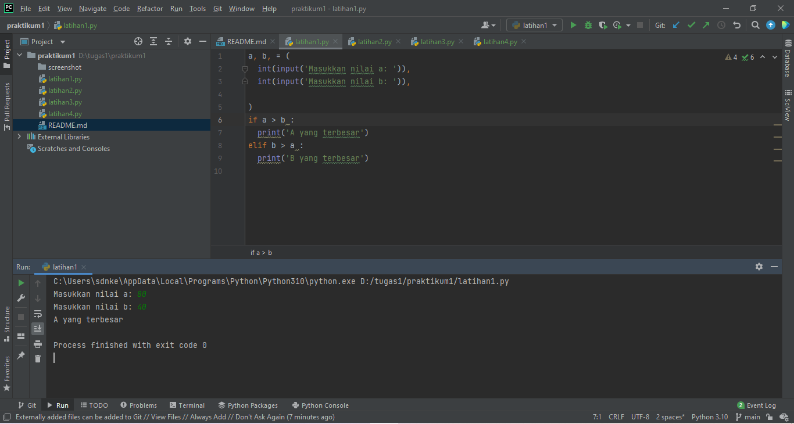
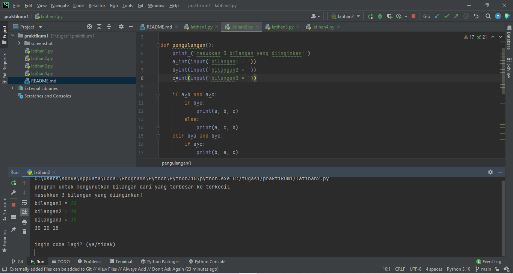
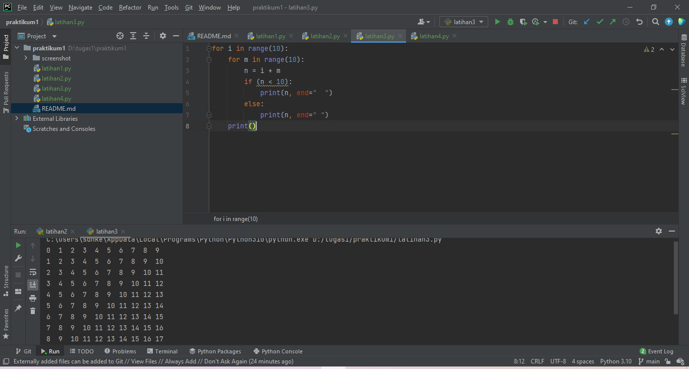
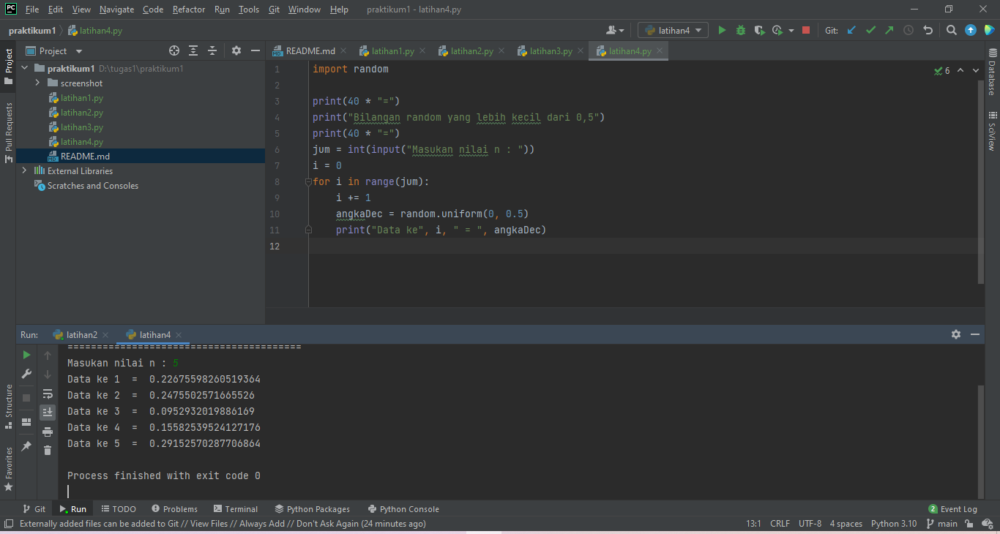

# praktikum1
## Latihan - latihan
### Program
Disini kita akan menggunakan pycharm sebagai editor program kita.

1.Buat program sederhada dengan input 2 buah bilangan, kemudian
tentukan bilangan terbesar dari kedua bilangan tersebut
menggunakan statement if.

Porgam yang pertama menggunakan statement if seperti ini:

untuk cript program bisa kalian cek di repository latihan1 dan untuk output bisa kalian,
lihat di gambar di atas.

2.Buat program untuk mengurutkan data berdasarkan input sejumlah
data (minimal 3 variable input atau lebih), kemudian tampilkan
hasilnya secara berurutan mulai dari data terkecil.

Disini kita akan mengurutkan 3 bilangan acak lalu tersusun hasil output nya dari yang terkecil ke terbesar.

Berikut pogram dan hasil output nya:

Di atas adalah hasil nya dan program nya dengan menggunakan if dan else lebih lengkap untuk script bisa klik latihan2.

3.Buat program dengan perulangan bertingkat (nested) for yang 
menghasilkan output sebagai berikut:

variable 10 sebagai titik tengah dari bilangan perulangan bertingkat nya.

Berikut gambar output dan program nya:

4.• Tampilkan n bilangan acak yang lebih kecil dari 0.5.
 
  • nilai n diisi pada saat runtime

  • anda bisa menggunakan kombinasi while dan for untuk 
menyelesaikannya

kita akan memasukan angka 5 jadi ada 5 variable apa bila kita juga memasukan 8 variable maka akan muncul 8 variable.

